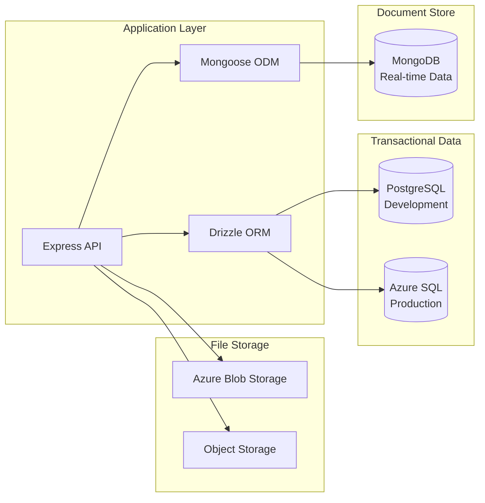
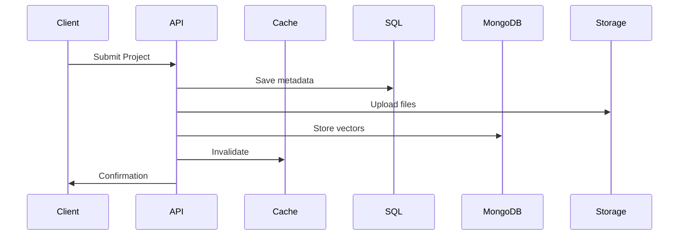
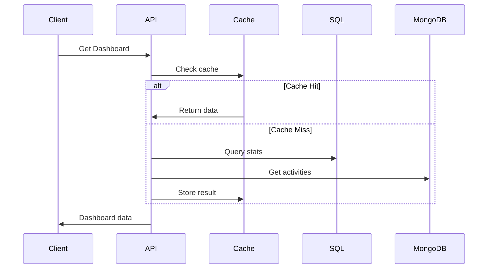
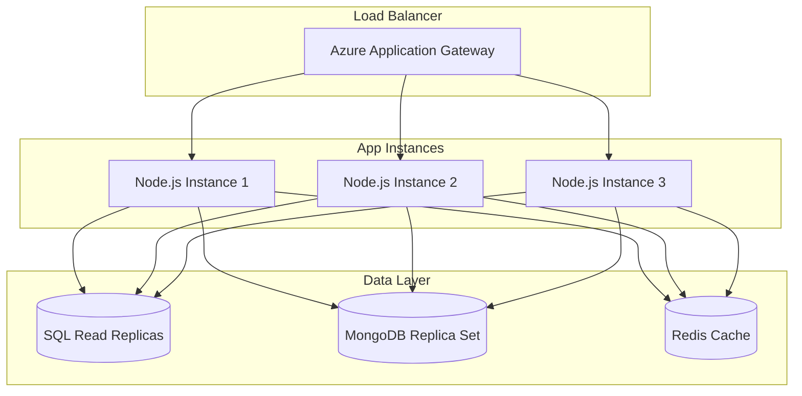
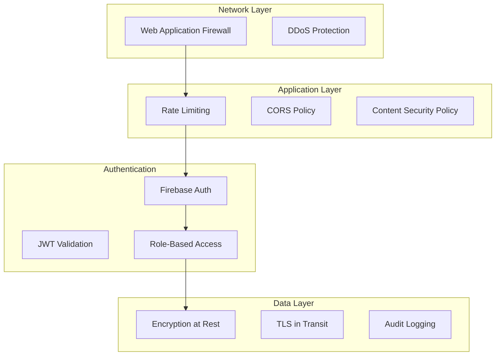
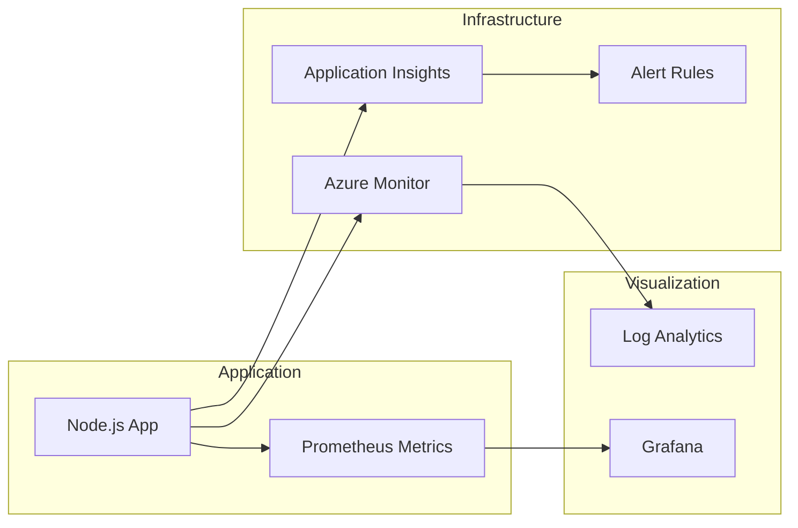
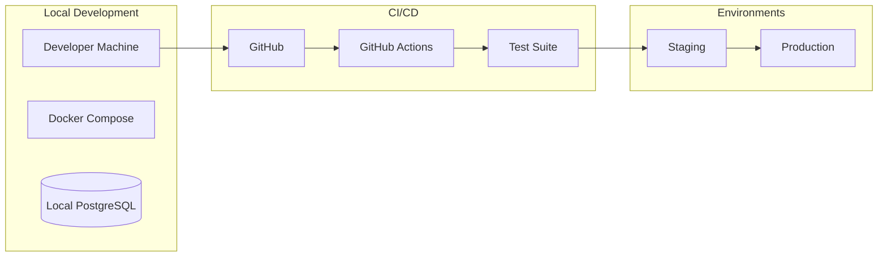

# Fusion X - System Architecture

## Overview

Fusion X employs a hybrid database architecture optimized for different data patterns and workloads. This document outlines the architectural decisions, data flow, and responsibilities of each component.

## Database Architecture

### Multi-Database Strategy



### PostgreSQL / Azure SQL Responsibilities

**Purpose**: Primary transactional database for structured, relational data

**Managed Data**:
- **Users & Authentication**
  - User profiles and credentials
  - Role assignments (Participant, Organizer, Judge)
  - Session management
  
- **Event Management**
  - Event metadata (name, dates, description)
  - Event tracks and categories
  - Registration settings and limits
  
- **Team Structure**
  - Team information and invite codes
  - Team member relationships
  - Team-event associations
  
- **Submissions**
  - Project metadata
  - Repository URLs
  - Submission status and timestamps
  
- **Judging System**
  - Judge assignments
  - Scoring criteria and weights
  - Evaluation scores and feedback
  - Round configurations
  
- **Sponsors**
  - Sponsor information and tiers
  - Display order and visibility

**Schema Example**:
```sql
-- Users table
CREATE TABLE users (
    id SERIAL PRIMARY KEY,
    email VARCHAR(255) UNIQUE NOT NULL,
    firebase_uid VARCHAR(255) UNIQUE,
    role VARCHAR(50) DEFAULT 'participant',
    created_at TIMESTAMP DEFAULT CURRENT_TIMESTAMP
);

-- Teams table
CREATE TABLE teams (
    id SERIAL PRIMARY KEY,
    name VARCHAR(255) NOT NULL,
    invite_code VARCHAR(10) UNIQUE,
    event_id INTEGER REFERENCES events(id),
    max_members INTEGER DEFAULT 4,
    created_at TIMESTAMP DEFAULT CURRENT_TIMESTAMP
);

-- Submissions table
CREATE TABLE submissions (
    id SERIAL PRIMARY KEY,
    team_id INTEGER REFERENCES teams(id),
    title VARCHAR(255) NOT NULL,
    description TEXT,
    repo_url VARCHAR(500),
    demo_url VARCHAR(500),
    status VARCHAR(50) DEFAULT 'draft',
    submitted_at TIMESTAMP
);
```

### MongoDB Responsibilities

**Purpose**: Document store for flexible, high-velocity data

**Managed Data**:
- **Real-time Communications**
  - Chat messages and Q&A threads
  - Announcements and notifications
  - User presence and typing indicators
  
- **Activity Logs**
  - User actions and audit trails
  - System events and telemetry
  - Performance metrics
  
- **Similarity Detection**
  - TF-IDF vectors for plagiarism detection
  - Code similarity indices
  - Submission fingerprints
  
- **Flexible Metadata**
  - Dynamic form responses
  - Custom fields and attributes
  - Unstructured submission data

**Schema Example**:
```javascript
// Announcement schema
{
  _id: ObjectId,
  eventId: String,
  title: String,
  content: String,
  author: {
    userId: String,
    name: String,
    role: String
  },
  timestamp: Date,
  priority: String,
  attachments: [{
    url: String,
    type: String
  }],
  reactions: [{
    userId: String,
    emoji: String
  }]
}

// Chat message schema
{
  _id: ObjectId,
  roomId: String,
  userId: String,
  message: String,
  timestamp: Date,
  edited: Boolean,
  editedAt: Date,
  replyTo: ObjectId,
  mentions: [String],
  attachments: [{
    url: String,
    name: String,
    size: Number
  }]
}

// Similarity vector schema
{
  _id: ObjectId,
  submissionId: String,
  tfidfVector: [Number],
  codeFingerprint: String,
  language: String,
  timestamp: Date,
  metadata: {
    lineCount: Number,
    tokenCount: Number,
    complexity: Number
  }
}
```

## Data Flow Patterns

### Write Patterns



### Read Patterns



## Technology Stack Details

### Backend Services

| Component | Technology | Purpose |
|-----------|------------|---------|
| Web Server | Express.js | HTTP server and routing |
| ORM | Drizzle | Type-safe SQL queries |
| ODM | Mongoose | MongoDB object modeling |
| WebSocket | Socket.IO | Real-time communication |
| Auth | Firebase Admin | Token verification |
| Security | Helmet.js | Security headers |
| Rate Limit | express-rate-limit | API throttling |

### Frontend Architecture

| Component | Technology | Purpose |
|-----------|------------|---------|
| Framework | React 18 | UI framework |
| Build Tool | Vite | Fast development builds |
| State | TanStack Query | Server state management |
| UI Library | shadcn/ui | Component library |
| Styling | TailwindCSS | Utility-first CSS |
| Router | Wouter | Lightweight routing |
| Forms | React Hook Form | Form management |
| Validation | Zod | Schema validation |

### Infrastructure

| Service | Provider | Purpose |
|---------|----------|---------|
| Database | Neon/Azure SQL | Primary data store |
| NoSQL | MongoDB Atlas | Document store |
| Storage | Azure Blob | File storage |
| CDN | Azure CDN | Static assets |
| DNS | Cloudflare | DNS management |
| SSL | Let's Encrypt | TLS certificates |

## Scaling Considerations

### Horizontal Scaling



### Caching Strategy

1. **Application Cache** (Redis)
   - Session data (15 min TTL)
   - User profiles (5 min TTL)
   - Leaderboard (30 sec TTL)
   
2. **Database Cache** (Query Result Cache)
   - Complex aggregations
   - Frequently accessed data
   
3. **CDN Cache** (Static Assets)
   - Images and media
   - JavaScript bundles
   - CSS files

### Performance Optimizations

1. **Database Indexing**
   ```sql
   -- Composite indexes for common queries
   CREATE INDEX idx_submissions_team_status 
   ON submissions(team_id, status);
   
   CREATE INDEX idx_scores_submission_round 
   ON scores(submission_id, round_number);
   ```

2. **Query Optimization**
   - Use database views for complex joins
   - Implement pagination for large datasets
   - Batch operations where possible

3. **MongoDB Optimization**
   ```javascript
   // Compound index for chat queries
   db.messages.createIndex({
     roomId: 1,
     timestamp: -1
   });
   
   // Text index for search
   db.announcements.createIndex({
     title: "text",
     content: "text"
   });
   ```

## Security Architecture

### Defense in Depth



### Security Measures

1. **API Security**
   - Helmet.js for security headers
   - Rate limiting (100 req/10 min/IP)
   - Input sanitization
   - SQL injection prevention

2. **Authentication & Authorization**
   - Firebase ID token verification
   - Role-based access control
   - Session management with secure cookies

3. **File Upload Security**
   - MIME type validation
   - File size limits (50MB)
   - Virus scanning (Azure Defender)
   - Executable blocking

## Monitoring & Observability

### Metrics Collection



### Key Metrics

1. **Application Metrics**
   - Request rate and latency
   - Error rate and types
   - Database query performance
   - WebSocket connections

2. **Business Metrics**
   - Active users
   - Submission rate
   - Judging progress
   - Team formation rate

3. **Infrastructure Metrics**
   - CPU and memory usage
   - Database connections
   - Storage usage
   - Network throughput

## Disaster Recovery

### Backup Strategy

1. **Database Backups**
   - Azure SQL: Automated daily backups (30-day retention)
   - MongoDB: Continuous replication with point-in-time recovery
   - PostgreSQL: Daily snapshots with 7-day retention

2. **File Storage**
   - Azure Blob: Geo-redundant storage (GRS)
   - Versioning enabled for critical files
   - Soft delete with 14-day retention

3. **Configuration Backup**
   - Infrastructure as Code (Terraform)
   - Environment variables in Azure Key Vault
   - GitHub repository for code

### Recovery Procedures

| Scenario | RTO | RPO | Procedure |
|----------|-----|-----|-----------|
| Database failure | 30 min | 1 hour | Restore from automated backup |
| Regional outage | 2 hours | 4 hours | Failover to secondary region |
| Data corruption | 1 hour | 24 hours | Point-in-time recovery |
| Complete disaster | 4 hours | 24 hours | Full environment rebuild |

## Development Workflow

### Environment Setup



### Deployment Pipeline

1. **Development**
   - Feature branches
   - Local testing
   - Code review

2. **Continuous Integration**
   - Automated tests
   - Linting and formatting
   - Security scanning

3. **Staging**
   - Integration tests
   - Performance testing
   - User acceptance testing

4. **Production**
   - Blue-green deployment
   - Health checks
   - Automatic rollback

## Future Enhancements

### Planned Improvements

1. **Performance**
   - GraphQL API implementation
   - Server-side rendering (SSR)
   - Edge caching with Cloudflare Workers

2. **Features**
   - AI-powered code review
   - Automated mentor matching
   - Blockchain certificates

3. **Infrastructure**
   - Kubernetes orchestration
   - Service mesh (Istio)
   - Multi-region deployment

### Technology Roadmap

| Quarter | Focus Area | Technologies |
|---------|------------|--------------|
| Q1 2024 | Performance | GraphQL, Redis Cluster |
| Q2 2024 | AI Features | OpenAI API, TensorFlow |
| Q3 2024 | Mobile Apps | React Native, Flutter |
| Q4 2024 | Blockchain | Ethereum, IPFS |

---

*Last Updated: August 2025*